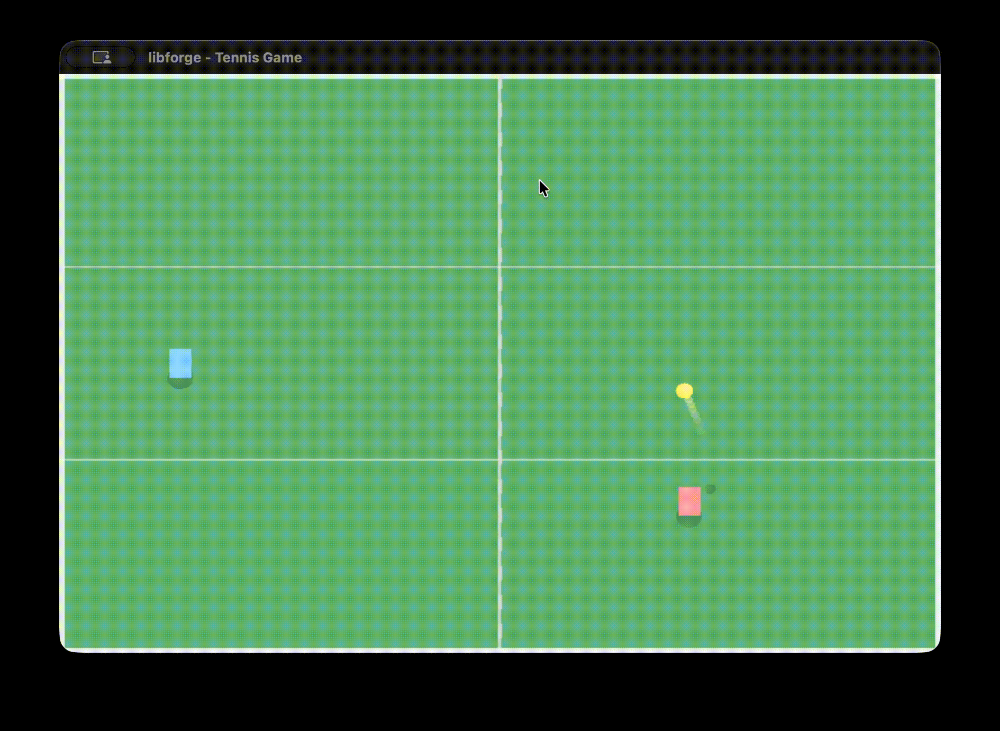

## libforge

A graphics library which is easy to use.  Initial plan is to only support MacOS and iOS and leverage the Apple Metal.

  

### Here's what we will use

1. Rust (Yessss)
2. wgpu
    1. GPU instances & surfaces

    2. Devices, queues, and swap chains

    3. Buffers & textures

    4. Shader modules (WGSL/SPIR-V)

    5. Render and compute pipelines
3. A windowing/event loop system: We can either use Rust bindings to macOS’s AppKit (Cocoa) APIs or a cross-platform crate like winit (if it supports iOS well, i really want to support iOS). Integration with UIKit and CAMetalLayer for Metal surfaces in iOS.

4. Immediate-Mode Drawing API

5. Math libraries: glam, nalgebra, or cgmath (we will pick the after some consideration)

6. Shaders & Shader Management: wgpu expects shaders in WGSL, SPIR-V, or other formats. We’ll need:

    1. A way to load/compile shaders

    2. Maybe hot-reloading support if you want fast iteration

    3. Helpers to convert your shading language to GPU data

    4. Because Metal has its own shading language, wgpu converts WGSL (or SPIR-V) into Metal shader code under the hood on Apple targets.

7. Event Loop & Timing

8. Resource Management: We will need utilities for managing fonts, textures (ideally cached and RAII style 🥲)
